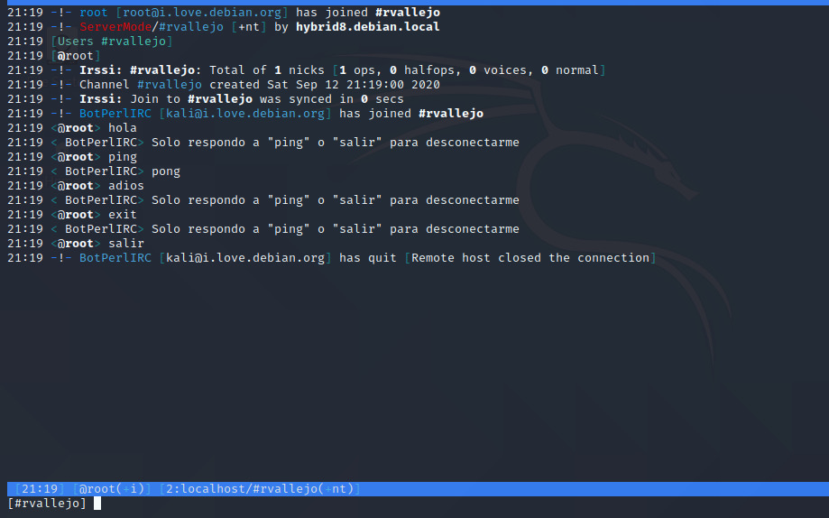
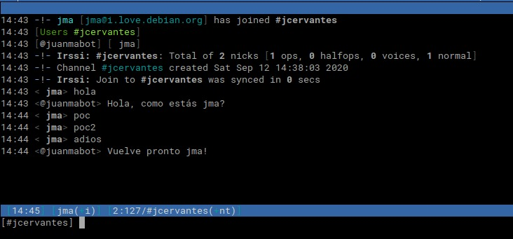

# Perl_14g
Repositorio del curso de Perl donde estarán las presentaciones, tareas y prácticas
## Tarea 1: FizzBuzz

El programa debe recibir un número como argumento, realizando una impresión de todos los números (menores o igual a él) en forma de lista. 

Si un numero es múltiplo de 2 delante de él debe imprimir Fuzz.

Si es múltiplo de 3 debe imprimir Buzz

Si es múltiplo de ambos (2 y 3) debe imprimir FizzBuzz

```bash
#Ejemplo de ejecución:
./fizzbuzz.pl 6
```
```
# Salida en terminal:
1
2 Fizz
3 Buzz
4 Fizz
5
6 FizzBuzz
```
## Tarea 2: Palíndromos
Hacer un programa que indique si las cadenas introducidas son o no son palíndromos.

Las cadenas que evaluará el programa pueden ser leídas de 2 formas:

1. Como argumentos del script

```bash
# Ejemplo de ejecución:
./t2_lapellido.pl anitalavalatina "no deseo ese don" readme "Sometamos o matemos" roma 
```
```bash
# Salida en terminal:
anitalavalatina : es palíndromo
no deseo ese don : es palindromo
readme : no es palindromo
Sometamos o matemos : es palindromo
roma : no es palindromo
```

2. Sin argumentos, en este caso evaluará las cadenas que se introduzcan mediante STDIN y terminar su ejecución cuando se introduzca la cadena: "ya no"

```bash
# Ejemplo de ejecución: 
./t2_lapellido.pl 
```
```bash
# Salida en terminal:
> adan nada
Es palindromo
> roma 
No es palindromo
> anitalavalatina 
Es palindromo
> ya no
```
## Tarea 3: Dibujo
Hacer un programa que dibuje un rombo incompleto.

El programa recibe como argumento el número de "*" que tendrá como base (central) para formar la figura.

```bash
# Ejemplo de ejecución:
./t3_lapellido.pl 6 
```
```bash
# Salida en terminal:
     *
     **
  ******
   ****
    **
     
```
```bash
# Ejemplo de ejecución: 
./t3_lapellido.pl 14
```
```bash
# Salida en terminal:
         *
         **
         ***
         ****
         *****
         ******
  **************
   ************
    **********
     ********
      ******
       ****
        **
```
```bash
# Ejemplo de ejecución: 
./t3_lapellido.pl 15
```
```bash
# Salida en terminal:
       *
       **
       ***
       ****
       *****
       ******
       *******
***************
 *************
  ***********
   *********
    *******
     *****
      ***
       *
```   
```bash
# Ejemplo de ejecución: 
./t3_lapellido.pl 7
```
```bash
# Salida en terminal:
   *
   **
   ***
*******
 *****
  ***
   *
```   

## Práctica 1: Escáner de red

Elaborar un script de Perl que realice un análisis de red con nmap (nmap –sP red/mascara) y elabore un reporte en txt con estadísticas sobre los resultados.

El script debe recibir como argumento la red/máscara que se va a analizar.

El nombre del archivo que contiene los resultadas debe llamarse: p1_lapellido.txt

Las estadísticas que deben reportarse son por Host: Puerto, Protocolo, Estado, Servicio, Versión

**Nota:** el formato para las estadísiticas es libre, se anexa un ejemplo de salida.
```bash
# Ejemplo de ejecución:
./p1_lapellido.pl 192.168.1.0/24
```
```bash
# Salida en terminal:
Se escribieron las estadisticas en el archivo: p1_lapellido.txt
```
```bash
# Ejemplo de salida de p1_lapellido.txt:
cat p1_lapellido.txt
```
```bash
Host: 192.168.1.1
PUERTO	PROTOCOLO	ESTADO	SERVICIO	VERSION
53	tcp		open	domain		dnsmasq 2.71
80	tcp		open	http		nginx
139	tcp		open	netbios-ssn		Samba smbd 3.X (workgroup: HUAWEI)
445	tcp		open	netbios-ssn		Samba smbd 3.X (workgroup: HUAWEI)
8192	tcp		open	http		nginx
8193	tcp		open	http		nginx
						
Host: 192.168.1.35
PUERTO	PROTOCOLO	ESTADO	SERVICIO	VERSION
22	tcp		open	ssh		OpenSSH 7.2p2 Ubuntu 4ubuntu2.8 (Ubuntu Linux; protocol 2.0)
25	tcp		open	smtp		Courier smtpd
143	tcp		open	imap		Courier Imapd (released 2011)
631	tcp		open	ipp		CUPS 2.1

```
## Práctica 2: Estadísticas de red

Utilizando el reporte generado de la práctica anterior (o generando uno nuevo), obtener estadísticas detalladas:

* Número de hosts que utilizan cada puerto detectado

* Número de puertos segun su clasificación (bien conocidos, registrados y de propósito general)

* Número de puertos segun su estado (abierto, filtrado, etc)

* Número de puertos según el protocolo (tcp y udp)

* Número de puertos activos por host

* SO de cada host (usar ping)

**Nota:** Recordemos que el TTL ayuda a detectar el SO del host 

Windows: 64<TTL<=128

Linux: 0<=TTL<=64 y 128<TTL<=255

Desconocido: -1

* Número de host por SO (Linux, Windows o desconocido)

Los resultados deben escribirse en un nuevo archivo.

**Nota:** Realizar el escaneo a un segmento de red que permita obtener las estadísticas, por ejemplo, el segmento privado de su red (192.x.x.x/x, 168.x.x.x/x), diferente de 127.x.x.x/x.

```bash
# Ejemplo de ejecución:
./p2_lapellido.pl 
```

```bash
# Salida en terminal:
El archivo de salida debe llamarse: p2_lapellido.txt y el formato de las estadísticas es libre.
```
## Práctica 3: Gráficas de estadísticas de red

Utilizando el reporte generado de la práctica anterior (p2_apellido.txt), generar las gráficas necesarias.

**Nota:** Instalar módulos de CPAN para generar las gráficas.

```bash
# Ejemplo de ejecución:
./p3_lapellido.pl
```

```bash
# Salida en terminal:
El formato de las gráficas es libre
```
## Práctica 4: Crawler

Hacer un crawler en perl, que analice hasta dos niveles y genere un reporte (en un archivo) 
con los enlaces encontrados en estructura de arbol.

**Opcional:** Convertir rutas relativas a absolutas

El sitio a analizar puede ser ingresado como argumento o entrada estándar, cualquiera de las dos o ambas.

```bash
# Ejemplo de ejecución:
./p4_lapellido.pl "https://example.com"
# o
./p4_lapellido.pl
> https://example.com

```
```bash
# Ejemplo de salida del archivo p4_lapellido.txt:
cat p4_lapellido.txt
```
```bash
https://example.com/
    https://example.com/
        https://example.com/dir/data.jpg
        robots.txt
    https://example.com/dir/
        /
        https://example.com/dir/image.jpg
        https://example.com/dir/image.jpg
        ./doc.txt
        ...
    https://example.com/imagen.jpg
    ...
```
## Práctica 5: calculadora científica

Realizar una calculadora científica que contenga las funciones: 

Seno, coseno, tangente, cotangente, operaciones aritmeticas(/ + - *), raíz cuadrada, potencia (sin usar función predefinida), factorial (sin usar función predefinida).

* La entrada debe ser una cadena con las operaciones a realizar, pudiendo ser más de una (ingresar los elementos y operaciónes separados por un espacio)
 
 Ej. "3.9 + 1 * 5.4 / sin ( 3 )"

* Tomar en cuenta la jerarquía de operaciones y uso de ( ).

* La forma de ingresar la cadena es de libre elección (por argumento, por entrada estandar o ambos).

```bash
# Ejemplo de ejecución (con argumento):
./p5_lapellido.pl "1 + 3 * ( 10 - 8 + sin ( 10 * 7 ) ) + 7"

```
```bash
# Ejemplo de salida:
16.8190
```
```bash
# Ejemplo de ejecución (sin argumento):
./p5_lapellido.pl
>1 + 2 + ( ( 5 * sin 25 ) / 5 / 10 ) - 3 ! - ( sqrt 4 + 3 ^ 5 )
-247.57
>1 + 3 * ( 10 - 8 + sin ( 10 * 7 ) ) + 7
16.8190
>( ( 2 + 1 ) * 3 ) !
362880
```
## Práctica 6: Bot IRC

Programar un bot en perl que ingrese al canal (nombre con el que entregan prácticas, primer letra del nombre seguido del apellido) y responda algunos mensajes públicos si cumplen algún patrón.

Intrucciones

1. Deberán instalar y configurar un servidor de IRC (usando repositorios de linux).

3. Instalar un cliente y conectarse al servidor IRC a través de la terminal.

4. Ingresar al canal, enviando mensajes aleatorios y mensajes que sean respondidos por el bot.

**Nota:** Nosotros usamos el modulo POC::Component::IRC, pero pueden usar algún otro si así lo prefieren.

```bash
# Ejemplo de cliente IRC en terminal
```




## Práctica 7: Cifrado Vigenere
Hacer un script que cifre y descifre un mensaje con el cifrado Vigenere. 

Recibe como argumento el mensaje y la clave o si se ejecuta sin argumentos los pide por entrada estándar. 

**Nota:** No utilizar módulos externos como Crypt::Vigenere.

## Práctica 8: SSH Bruteforce
Hacer un script que realice ataques de fuerza bruta para conectarse por medio de SSH.

Recibe como argumentos el archivo de usuarios y el de contraseñas a probar.

**Nota:** Preparar el ambiente local para que prueben su script.

**Nota:** Pueden utilizar módulos externos para realizar las conexiones SSH.

## Práctica 10: Keylogger
Usando el código proporcionado en clase, terminar el keylogger que debe recibir como argumento el nombre de un archivo, en el cual se irán guardando todas las teclas presionadas mientras se esté ejecutando el keylogger.

**Nota:** El keylogger debe reconocer como mínimo, minúsculas y mayúsculas

**Referencias:** [pack](https://perldoc.perl.org/functions/pack.html) [unpack](https://perldoc.perl.org/functions/unpack.html) [perlpacktut](https://perldoc.perl.org/perlpacktut.html)

**Hint:** [Keylogger](https://www.youtube.com/watch?v=kgMrI2Dwwsw)
